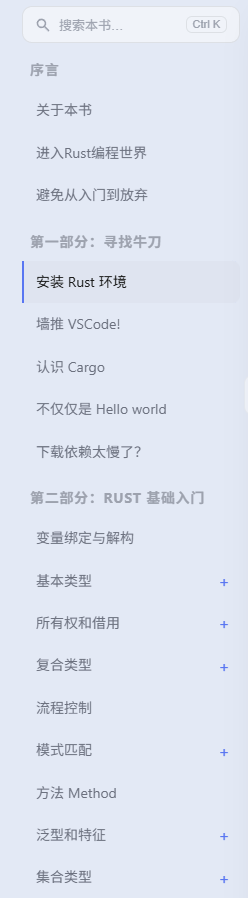

# Rust语言圣经
https://beatai.org/rust-course/first-try/installation


https://github.com/sunface/rust-course


配套练习：https://github.com/sunface/rust-by-practice


## 本地运行
我们使用 [mdbook](https://rust-lang.github.io/mdBook/) 构建在线练习题，你也可以下载到本地运行：
```shell
$ git clone https://github.com/sunface/rust-by-practice
$ cargo install mdbook
$ cd rust-by-practice && mdbook serve zh-CN/
```

在本地win 10或者linux服务器上运行时，应当使用 -n 参数指定mdbook服务所监听的IP地址（-p 参数指定服务监听的端口，不指定则为默认的3000），以win 10本地运行为例：
```shell
$ mdbook serve -p 8823 -n 127.0.0.1 zh-CN/
```


# Rust语言实战
https://github.com/sunface/rust-by-practice/blob/master/zh-CN/src/why-exercise.md