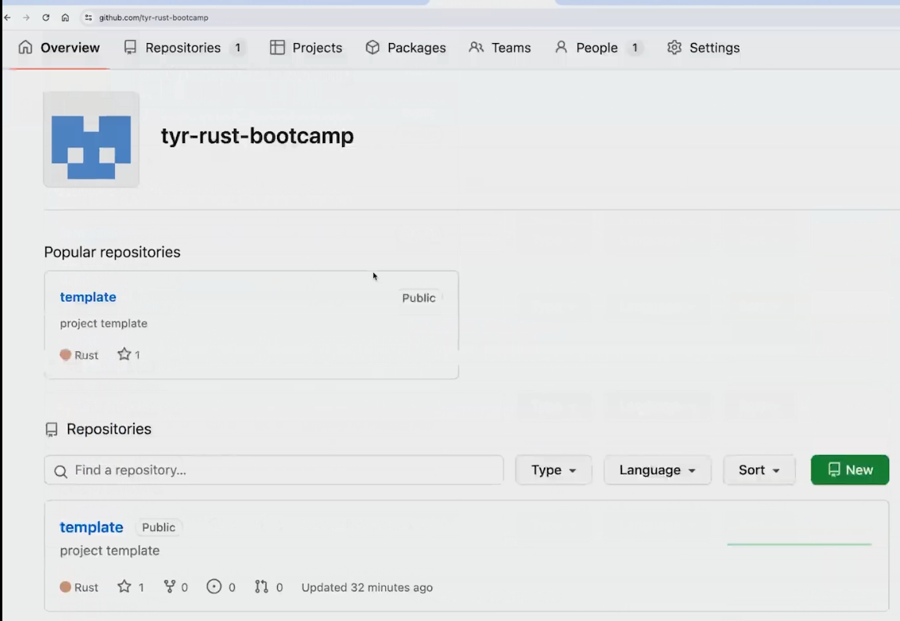
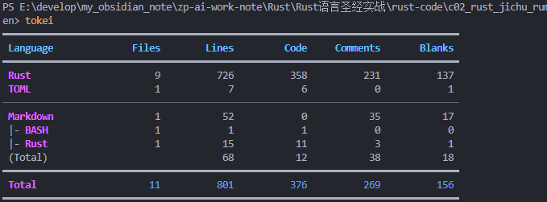

### 资源位置
本地电脑1：F:\BaiduNetdiskDownload\Rust 训练营\第1周：从 Hello world 到实用的 CLI 工具
百度网盘：技术栈／Rust/Rust 训练营

### 代码1
https://github.com/tyr-rust-bootcamp

### 代码2
https://github.com/smallnest/concurrency-programming-via-rust




### 安装 VSCode 插件
- crates: Rust 包管理
- Even Better TOML: TOML 文件支持
- Better Comments: 优化注释显示
- Error Lens: 错误提示优化
- GitLens: Git 增强
- Github Copilot: 代码提示
- indent-rainbow: 缩进显示优化
- Prettier - Code formatter: 代码格式化
- REST client: REST API 调试
- rust-analyzer: Rust 语言支持
- Rust Test lens: Rust 测试支持
- Rust Test Explorer: Rust 测试概览
- TODO Highlight: TODO 高亮
- vscode-icons: 图标优化
- YAML: YAML 文件支持

### 安装 cargo generate
cargo generate 是一个用于生成项目模板的工具。它可以使用已有的 github repo 作为模版生成新的项目。
```bash
cargo install cargo-generate
```

在我们的课程中，新的项目会使用 `tyr-rust-bootcamp/template` 模版生成基本的代码：
```bash
cargo generate tyr-rust-bootcamp/template
```

### 安装 pre-commit
pre-commit 是一个代码检查工具，可以在提交代码前进行代码检查。
```bash
pipx install pre-commit
```
安装成功后运行 `pre-commit install` 即可。
实际情况是会根据本机的Python进行处理，建议如下：
```
C:\Users\Administrator\.pyenv\pyenv-win\versions\3.12.10\python.exe -m pip install pre-commit
C:\Users\Administrator\.pyenv\pyenv-win\versions\3.12.10\python.exe -m pre_commit install --overwrite
```
然后重新提交：
```bash
git commit -m "docs: 修改项目名称，增加说明文档"
```
如果只是临时跳过检查，也可以用：
```bash
git commit --no-verify -m "docs: 修改项目名称，增加说明文档"
```

### 安装 Cargo deny
Cargo deny 是一个 Cargo 插件，可以用于检查依赖的安全性。

```bash
cargo install --locked cargo-deny
```

### 安装 typos
typos 是一个拼写检查工具。

```bash
cargo install typos-cli
```

### 安装 git cliff
git cliff 是一个生成 changelog 的工具。

```bash
cargo install git-cliff
```

### 安装 cargo nextest
cargo nextest 是一个 Rust 增强测试工具。

```bash
cargo install cargo-nextest --locked
```


### 安装 tokei
tokei 是一个 Rust 代码统计工具。

```bash
cargo install tokei
```



# 使用指南
## 1. `cargo check` — 编译检查

```bash
# 检查整个项目能否通过编译（不生成可执行文件，速度最快）
cargo check --all
```

| 参数      | 作用            |
| ------- | ------------- |
| `--all` | 检查工作区所有 crate |
**适用场景：** 日常快速检查代码是否有编译错误，比 `cargo build` 快得多。

## 2. `cargo nextest` — 增强测试

```bash
# 运行所有测试
cargo nextest run --all-features

# 只看测试列表不执行
cargo nextest list --all-features

# 失败时显示详细信息
cargo nextest run --all-features --failure-output=immediate

# 重新运行失败的测试
cargo nextest run --all-features --retries 2

```


| 参数                           | 作用                     |
| ---------------------------- | ---------------------- |
| `--all-features`             | 启用所有 feature           |
| `--failure-output=immediate` | 测试失败时立即输出详细信息          |
| `--retries N`                | 失败重试 N 次               |
| `--test NAME`                | 只运行指定的测试函数             |
| `-j N`                       | 并行运行 N 个测试（默认 CPU 核心数） |

**与 `cargo test` 区别：** nextest 更快、更稳定、输出更友好，失败信息带 diff。`cargo test` 是 Rust 自带的，nextest 是增强替代版。

## 3. `cargo clippy` — 代码 Lint
 
```bash
# 完整 lint 检查（当前项目的配置）
cargo clippy --all-targets --all-features --tests --benches -- -D warnings

# 简化版（日常用）
cargo clippy

# 自动修复建议
cargo clippy --fix
```


| 参数               | 作用                              |
| ---------------- | ------------------------------- |
| `--all-targets`  | 检查 lib、bin、test、bench 所有 target |
| `--all-features` | 启用所有 feature                    |
| `--tests`        | 包含测试代码                          |
| `--benches`      | 包含基准测试代码                        |
| `-- -D warnings` | 将所有 warning 视为 error（严格模式）      |
| `--fix`          | 自动应用 clippy 的修复建议               |
  
**适用场景：** 提交前必跑，保证代码质量。比 `cargo check` 检查更严格，包含代码风格、反模式等。

## 4. `cargo fmt` — 代码格式化

```bash
# 检查格式（不修改文件）
cargo fmt -- --check

# 自动格式化所有 Rust 文件（不传 --check）
cargo fmt

# 检查单个文件
cargo fmt -- --check src/main.rs
```

| 参数           | 作用             |
| ------------ | -------------- |
| `-- --check` | 只检查不修改（CI 中常用） |
| 不加 `--check` | 直接格式化文件        |

**注意：** `cargo fmt` 会直接修改文件，`--check` 模式只返回值 0 或 1。

## 5. `cargo deny` — 依赖安全检查
 
```bash
# 执行全部检查（包括 advisories、licenses、bans、sources）
cargo deny check

# 只检查安全通告
cargo deny check advisories

# 只检查许可证合规
cargo deny check licenses

# 只检查依赖禁用列表
cargo deny check bans

# 只检查来源（registry / git 来源限制）
cargo deny check sources
```

**当前配置策略（`deny.toml`）：**

| 检查类型                       | 策略     | 说明               |
| -------------------------- | ------ | ---------------- |
| `advisories.vulnerability` | `deny` | 有安全漏洞直接报错        |
| `advisories.unmaintained`  | `warn` | 无人维护的依赖报警告       |
| `licenses.default`         | `deny` | 不认识的许可证默认拒绝      |
| `licenses.copyleft`        | `warn` | 感染性许可证报警告        |
| `bans.multiple-versions`   | `warn` | 同一 crate 多版本警告   |
| `sources.unknown-registry` | `warn` | 非 crates.io 来源警告 |
  
**适用场景：** 添加依赖后运行，确保没有引入有漏洞或不合规的 crate。
 

## 6. `typos` — 拼写检查

```bash
# 检查当前目录所有文件的拼写错误
typos

# 输出详细报告
typos --verbose
```

**适用场景：** 提交前检查代码中的拼写错误，尤其是变量名、注释等。

## 7. `git cliff` — 生成 CHANGELOG

```bash
# 基于当前所有 commit 生成 changelog
git cliff
 
# 输出到文件
git cliff -o CHANGELOG.md

# 从最新的 tag 开始
git cliff --latest

# 指定版本号
git cliff --unreleased --tag v0.2.0

# 只输出未发布的更改
git cliff --unreleased
```

| 参数                  | 作用                   |
| ------------------- | -------------------- |
| `-o, --output FILE` | 输出到文件                |
| `--latest`          | 只处理最新 tag 以来的变更      |
| `--unreleased`      | 只输出未发布的变更            |
| `--tag VERSION`     | 指定要处理的版本             |
| `--prepend FILE`    | 追加到已有 CHANGELOG 文件开头 |
  
**前提条件：** commit 信息遵循 [Conventional Commits](https://www.conventionalcommits.org/) 规范，如：

```
feat: 添加图片识别功能
fix: 修复内存泄漏
docs: 更新 README
```

**当前 `cliff.toml` 配置：** 自动按 feat/fix/docs/perf/refactor/style/test/chore 分组，中文 commit 会被跳过。
## 8. pre-commit — 自动代码检查

```bash
# 安装 git hooks
pre-commit install

# 手动运行所有 hooks（对所有文件）
pre-commit run --all-files

# 运行单个 hook
pre-commit run cargo-clippy --all-files

# 只检查已暂存的文件
pre-commit run

# 更新 hooks 到最新版本
pre-commit autoupdate

# 清理 hook 缓存
pre-commit clean
```

**当前配置的所有 hook（commit 时自动按顺序执行）：**

| 步骤  | Hook                      |      说明      | 失败则拒绝提交 |
| :-: | ------------------------- | :----------: | :-----: |
|  1  | `check-byte-order-marker` | 检查文件 BOM 标记  |    ✓    |
|  2  | `check-case-conflict`     |  检查文件名大小写冲突  |    ✓    |
|  3  | `check-merge-conflict`    | 检查残留的合并冲突标记  |    ✓    |
|  4  | `check-symlinks`          |    检查符号链接    |    ✓    |
|  5  | `check-yaml`              |  检查 YAML 格式  |    ✓    |
|  6  | `end-of-file-fixer`       |  确保文件末尾有换行   |    ✓    |
|  7  | `mixed-line-ending`       |    统一行尾符     |    ✓    |
|  8  | `trailing-whitespace`     |   去除行尾多余空格   |    ✓    |
|  9  | `black`                   | Python 代码格式化 |    ✓    |
| 10  | `cargo fmt`               |  Rust 代码格式化  |    ✓    |
| 11  | `cargo deny`              |    依赖安全审计    |    ✓    |
| 12  | `typos`                   |     拼写检查     |    ✓    |
| 13  | `cargo check`             |  Rust 编译检查   |    ✓    |
| 14  | `cargo clippy`            | Rust 代码 lint |    ✓    |
| 15  | `cargo nextest`           |    运行单元测试    |    ✓    |

## 推荐日常开发流程

```bash
# 1. 开发代码 

# 2. 提交前手动跑一遍完整检查
cargo check --all && cargo clippy --all-targets --all-features --tests --benches -- -D warnings && cargo nextest run --all-features

# 3. 暂存并提交（pre-commit 会自动再跑一遍）
git add .
git commit -m "feat: 添加xxx功能"


# 4. 发布新版本时生成 CHANGELOG
git cliff -o CHANGELOG.md
```
